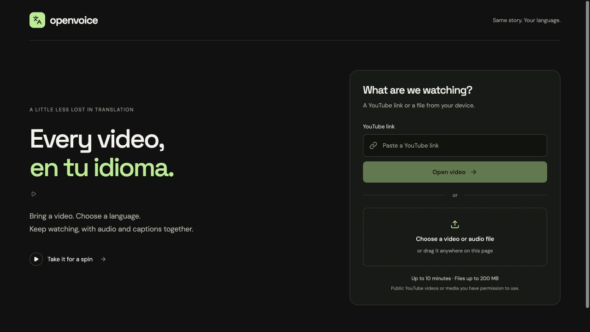
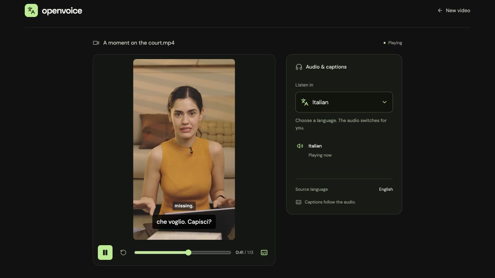
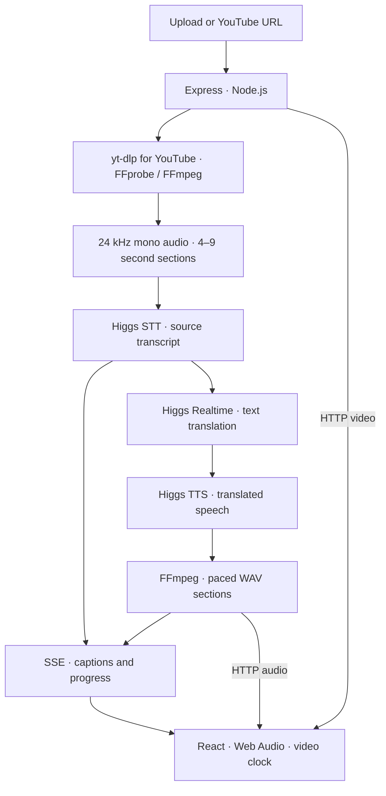

# OpenVoice

Every video, in your language.

Paste a YouTube link or upload a clip. OpenVoice transcribes the speech, translates it, and plays a new voice with captions that follow the video.

[Try the app](https://rudrakshkarpe.com/openvoice/) · [Interactive presentation](https://rudrakshkarpe.com/presentations/openvoice) · [Architecture](docs/ARCHITECTURE.md) · [Deployment](docs/DEPLOYMENT.md)



## Watch in another language

1. Paste a public YouTube video or Shorts link, upload a file, or try the sample.
2. Choose a language under **Listen in**. The current audio continues while the first translated phrases prepare.
3. Keep watching. Audio switches automatically, captions follow the audible language, and upcoming phrases load in the background.

The player keeps the video's aspect ratio. One language selector, playback controls and a caption toggle are the main interface; processing diagnostics stay out of the way.



## Architecture



This is **progressive, phrase-level delivery**. Each section finishes translation and synthesis before publication; the whole video does not need to finish first. SSE carries text, status and audio URLs—not audio bytes. The browser fetches and decodes upcoming sections, then schedules them back-to-back on the Web Audio clock.

Generation prioritizes the playhead and the selected language. Completed sections are cached for the session. Longer translations use bounded, pitch-preserving tempo adjustment; when they still need more time, the video slows to match. If generation falls behind, audio and video pause together and resume once buffered.

[Playback timing, queues, endpoints and failure handling →](docs/ARCHITECTURE.md)

## Run locally

Requires **Node.js 22+**, **FFmpeg / ffprobe**, a recent **yt-dlp**, and a Boson API key with available credits. No InsForge account or GPU is needed for local development.

```sh
# macOS media dependencies
brew install ffmpeg yt-dlp

git clone https://github.com/rudrakshkarpe/open-voice.git
cd open-voice
npm ci
cp .env.example .env.local
```

Set `BOSON_API_KEY` in `.env.local`, then start both services:

```sh
npm run dev
```

Open [localhost:5173](http://127.0.0.1:5173/). Vite serves the frontend and proxies `/api` to Express on port `8787`. Leave `VITE_API_ORIGIN` empty locally.

## Boson AI

The integration lives in [`server/boson.ts`](server/boson.ts). All provider requests originate on the server and authenticate with `BOSON_API_KEY` as a Bearer token. Follow [Boson's authentication guide](https://docs.boson.ai/authentication) to create a key; never put it in a `VITE_` variable or commit it.

| Stage | Current configuration |
| --- | --- |
| Transcription | `higgs-stt-3.1` through a Realtime WebSocket session; explicit commits of 24 kHz PCM audio |
| Translation | `higgs-realtime`, text-only output; nearby transcript sections provide context |
| Speech | `higgs-tts-3`, voice `chloe`, MP3 output from `/v1/audio/speech` |
| Playback preparation | FFmpeg decodes speech, adjusts timing and writes individual WAV sections |

Transcription, translation and speech share one provider-request slot to limit concurrency. TTS retries rate-limit responses with bounded backoff. Source-language detection uses accumulated transcript evidence; it is not an acoustic confidence score.

The generated voice is a preset, not a clone of the original speaker. Translation quality and pronunciation vary by language.

## Infrastructure

| Layer | How it is set up |
| --- | --- |
| Frontend | React, TypeScript and Vite. The existing website's GitHub Pages workflow builds a pinned OpenVoice commit and publishes it under `/openvoice/`. |
| Backend | Express on **InsForge Custom Compute**. The [Dockerfile](Dockerfile) packages Node 22, FFmpeg and yt-dlp, running as a non-root user on port `8080`. |
| Hosting configuration | One `shared-1x`, 512 MB service with scale-to-zero. InsForge manages the underlying compute; there is no separate Google Cloud deployment. |
| Media and jobs | In-memory jobs and temporary files in the backend container. No database, object-storage bucket or durable media library. |
| Provider | Boson AI, called directly by the backend. Its credits and billing are separate from InsForge hosting. |

In production, `VITE_BASE_PATH=/openvoice/` sets the asset path and `VITE_API_ORIGIN` points to the compute backend. CORS allows the website origins. The Boson key stays in the backend runtime environment, never in the Pages build.

InsForge is used for container hosting—not its auth, database, storage, Edge Functions or AI gateway. LiveKit is not part of this pipeline: the input is recorded media, not a live call.

The [deployment guide](docs/DEPLOYMENT.md) records the linked project, runtime variables, deploy commands, free-plan constraints and rollback procedure. [`scripts/deploy-insforge.mjs`](scripts/deploy-insforge.mjs) deploys the backend without putting the API key in command arguments.

## Demo boundaries

- **200 MB / 10 minutes per clip.** Uploads accept browser-playable MP4, MOV, WebM, MP3 and WAV. YouTube imports request H.264/AAC MP4 up to 720p.
- **Public, accessible YouTube videos only.** Private, live, age-restricted or sign-in-required videos are not supported. Cloud downloads can still be blocked; an authorized local file is the fallback.
- **Shared capacity.** The hosted demo retains up to eight sessions, processes two source jobs at once, allows three translated languages per video and has a shared 300-provider-request daily guard. The request counter also resets on restart; it is not a billing cap.
- **Temporary sessions.** Disconnected sessions expire after a two-minute reconnect grace. A backend restart clears jobs; reopen the video afterward. Scale-to-zero can add a cold-start delay.
- **Not zero-latency dubbing.** First phrases take time to generate, captions use approximate phrase timing, and buffering can occur. There is no lip-sync, speaker diarization or background-music preservation.
- **No user authentication.** Anyone with a session's media URL can access its temporary files. Only process media you are authorized to use; do not upload sensitive material to the public demo.

## Development

```sh
npm run lint
npm test
npm run build
```

Open the app with `?debug=1` before importing to inspect the source transcript, extracted audio, language switches, buffer coverage and clock drift.

| Where | Responsibility |
| --- | --- |
| [`src/components/Welcome.tsx`](src/components/Welcome.tsx) | Landing screen and imports |
| [`src/hooks/useMediaSession.ts`](src/hooks/useMediaSession.ts) | Session lifecycle, progress events and import retries |
| [`src/hooks/useDubPlayer.ts`](src/hooks/useDubPlayer.ts) | Language switching, buffering and video synchronization |
| [`src/lib/audioQueue.ts`](src/lib/audioQueue.ts) | Web Audio scheduling |
| [`server/media.ts`](server/media.ts) | Media routes, extraction and translation jobs |
| [`server/boson.ts`](server/boson.ts) | Boson transcription, translation and speech |

Tests cover queues, session expiry, import recovery, segmentation, captions and playback scheduling. Provider latency, YouTube availability and speech quality still need live checks.
